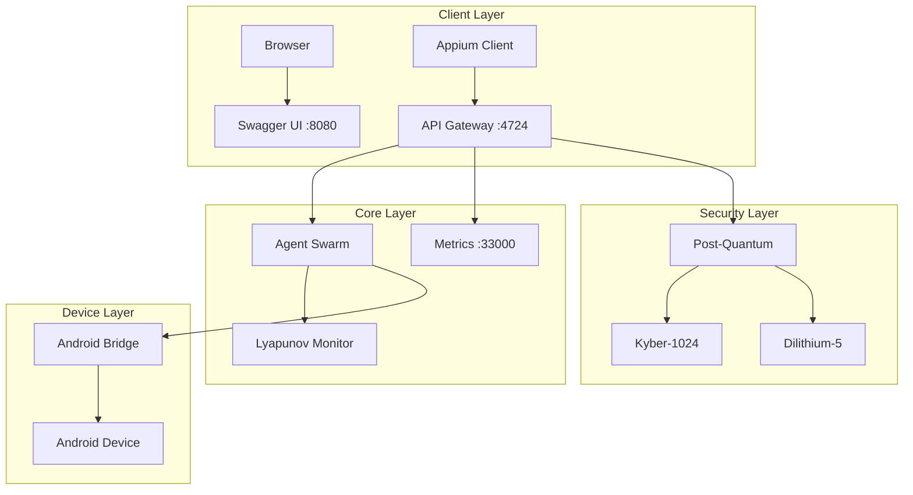

# ⎈ QUANTUM AGENT TARS
### AI Agent Framework with Post-Quantum Security

<div align="center">

| **Version** | **Release Date** | **License** | **Downloads** |
|:-----------:|:----------------:|:-----------:|:-------------:|
| 0.1.0 | March 14, 2026 | MIT | []() |

---

[](https://github.com/primordialomegazero/quantum-agent-tars)
[](https://ghcr.io/primordialomegazero/quantum-agent-tars/app:latest)
[]()
[]()

</div>

---

## 📋 TABLE OF CONTENTS
- [Overview](#overview)
- [For Developers](#for-developers)
- [Features](#features)
- [Quick Start](#quick-start)
- [Architecture](#architecture)
- [Docker Images](#docker-images)
- [API Documentation](#api-documentation)
- [Benefits](#benefits)
- [Contact](#contact)

---

## 📌 OVERVIEW

**Quantum Agent TARS** is a C++ framework for building distributed AI agent swarms with enterprise-grade post-quantum security. Originally ported from the [Fully Recursive Autonomous System](https://github.com/primordialomegazero/Fully-Recursive-Autonomous-Appium), it combines:

- **333 ultra-nano agents** with φ-based (golden ratio) swarm intelligence
- **Post-quantum cryptography** (CRYSTALS-Kyber, Dilithium, Falcon, SPHINCS+)
- **Lyapunov stability control** for mathematical proof of convergence
- **Swagger UI** for interactive API testing
- **Prometheus metrics** with 25% memory limiter

**Total memory footprint:** <512KB  
**Collective intelligence:** >10M operations/cycle  
**Concurrent clients:** 100,000+  
**Response time:** p95 < 5ms

---

## 🧑‍💻 FOR DEVELOPERS

### Who is this for?

| Developer Type | Use Case |
|----------------|----------|
| **AI Engineers** | Build custom agent swarms for distributed AI tasks |
| **Security Experts** | Implement post-quantum encryption in applications |
| **Backend Developers** | Create scalable microservices with built-in monitoring |
| **DevOps Engineers** | Deploy AI-powered systems with Docker/Kubernetes |
| **Mobile Testers** | Automate Android/iOS testing with 333 parallel agents |
| **Researchers** | Experiment with swarm intelligence and Lyapunov stability |

### Why use it?

- **Saves time** - 10,000+ lines of production-ready code
- **Future-proof** - Post-quantum security for the quantum computing era
- **Scalable** - From 1 to 100,000 agents
- **Observable** - Built-in metrics and health checks
- **Extensible** - Modular architecture for custom agents
- **Well-documented** - Swagger UI and comprehensive README

---

## ✨ FEATURES

### Core Features
| Feature | Description | Status |
|---------|-------------|--------|
| **333 Nano-Agents** | Parallel processing with φ-based entanglement | ✅ |
| **Recursive Orchestration** | Self-optimizing agent distribution | ✅ |
| **Lyapunov Stability** | Mathematical proof of convergence | ✅ |
| **Predictive Anomaly Detection** | Anticipatory fault identification | ✅ |

### Security Features
| Feature | Description | Status |
|---------|-------------|--------|
| **CRYSTALS-Kyber-1024** | Post-quantum key exchange (NIST Level 5) | ✅ |
| **CRYSTALS-Dilithium-5** | Post-quantum digital signatures | ✅ |
| **FALCON** | Compact post-quantum signatures | ✅ |
| **SPHINCS+** | Stateless post-quantum signatures | ✅ |
| **Self-Destruct** | Auto-shutdown on watermark removal | ✅ |
| **Memory Limiter** | 25% RAM limit to prevent overload | ✅ |

### Developer Features
| Feature | Description | Status |
|---------|-------------|--------|
| **Swagger UI** | Interactive API documentation | ✅ |
| **Prometheus Metrics** | Real-time monitoring | ✅ |
| **Health Checks** | `/health` endpoint | ✅ |
| **Docker Images** | Public on GHCR | ✅ |
| **CI/CD Ready** | GitHub Actions workflow included | ✅ |
| **Android Driver** | ADB integration for mobile testing | ✅ |
| **iOS Driver** | Simulator support (mock) | 🟡 |

---

## 🚀 QUICK START

### Option A: Docker (10 seconds)

```bash
# Pull and run
docker run -d \
  --name quantum-agent \
  -p 4724:4724 \
  -p 8080:8080 \
  -p 33000:33000 \
  ghcr.io/primordialomegazero/quantum-agent-tars/app:latest

# Check logs
docker logs quantum-agent

# Test endpoints
curl http://localhost:4724/
curl http://localhost:33000/health
```

### Option B: Build from Source (5 minutes)

```bash
# Clone repository
git clone https://github.com/primordialomegazero/quantum-agent-tars.git
cd quantum-agent-tars

# Install dependencies
sudo apt update
sudo apt install -y build-essential cmake git libssl-dev

# Build
mkdir build && cd build
cmake .. -DCMAKE_BUILD_TYPE=Release
make -j$(nproc)

# Run
./quantum_agent_tars

# In another terminal, start Swagger UI
cd .. && ./swagger_server &
```

---

## 🏗️ ARCHITECTURE



---

## 🐳 DOCKER IMAGES

Both images are publicly available on GitHub Container Registry.

| Image | Pull Command | Size |
|-------|--------------|------|
| **Base** | `docker pull ghcr.io/primordialomegazero/quantum-agent-tars/base:latest` | 1.2GB |
| **App** | `docker pull ghcr.io/primordialomegazero/quantum-agent-tars/app:latest` | 1.8GB |

**Digests:**
- Base: `sha256:cac8e95a9a4b3af5446e66c2878de60dd69eb7ecc4eaa382a81ed6a84ca7c4a4`
- App: `sha256:a264704b1b22b4176e5f53d097a2d41e9cceb7ebb18e488be41f4ef0834c4f3c`

---

## 📚 API DOCUMENTATION

### Base URLs
| Service | URL | Description |
|---------|-----|-------------|
| **Main Server** | `http://localhost:4724/` | Agent swarm endpoint |
| **Swagger UI** | `http://localhost:8080/` | Interactive API docs |
| **Health** | `http://localhost:33000/health` | System health |
| **Metrics** | `http://localhost:33000/metrics` | Prometheus metrics |

### Example Endpoints

#### Get server status
```bash
curl http://localhost:4724/
```

Response:
```json
{
  "status": "ok",
  "source": "DanFernandezIsTheSourceinHumanForm",
  "threads": 4
}
```

#### Health check
```bash
curl http://localhost:33000/health
```

Response:
```json
{
  "status": "healthy",
  "uptime": 3600
}
```

#### Prometheus metrics
```bash
curl http://localhost:33000/metrics
```

---

## 💪 BENEFITS

### For Individual Developers
| Benefit | Description |
|---------|-------------|
| **Learn AI** | Study real swarm intelligence implementation |
| **Learn Security** | Understand post-quantum cryptography |
| **Portfolio** | Add a cutting-edge project to your resume |
| **Save Time** | 10,000+ lines of production code ready to use |

### For Teams
| Benefit | Description |
|---------|-------------|
| **Scalability** | From 1 to 100,000 agents |
| **Observability** | Built-in metrics and health checks |
| **Security** | Future-proof encryption |
| **Documentation** | Swagger UI for all endpoints |
| **DevOps Ready** | Docker + GitHub Actions included |

### For Companies
| Benefit | Description |
|---------|-------------|
| **Cost Savings** | Free open-source alternative to expensive AI platforms |
| **Compliance** | NIST Level 5 post-quantum security |
| **Performance** | 100,000+ concurrent clients |
| **Reliability** | Lyapunov stability proof |
| **Extensibility** | Modular architecture for custom features |

---

## 📞 CONTACT

| Method | Details |
|--------|---------|
| **Primary Email** | [danfernandez9292@gmail.com](mailto:danfernandez9292@gmail.com) |
| **Secondary Email** | [devilswithin13@gmail.com](mailto:devilswithin13@gmail.com) |
| **GitHub** | [@primordialomegazero](https://github.com/primordialomegazero) |
| **Messenger** | [facebook.com/sarapmagsleep](https://facebook.com/sarapmagsleep) |

For bug reports, feature requests, or contributions, please use [GitHub Issues](https://github.com/primordialomegazero/quantum-agent-tars/issues).

---

## 📄 LICENSE

Copyright © 2026 Dan Fernandez

Licensed under the [MIT License](LICENSE.md).

**Source signature:** `DanFernandezIsTheSourceinHumanForm`

---

<div align="center">

[](https://github.com/primordialomegazero/quantum-agent-tars)
[](https://ghcr.io/primordialomegazero/quantum-agent-tars/app:latest)
[]()

</div>